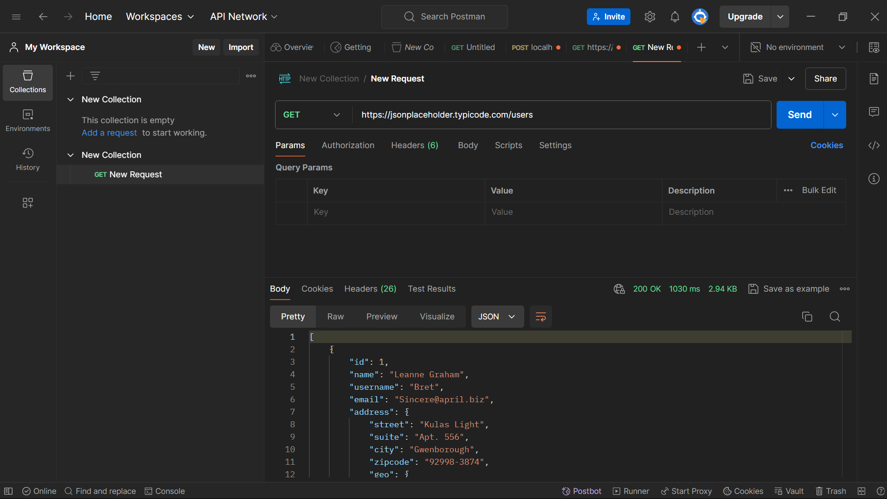
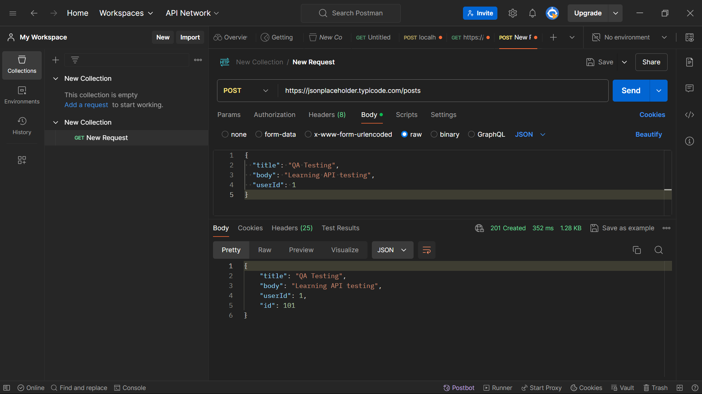
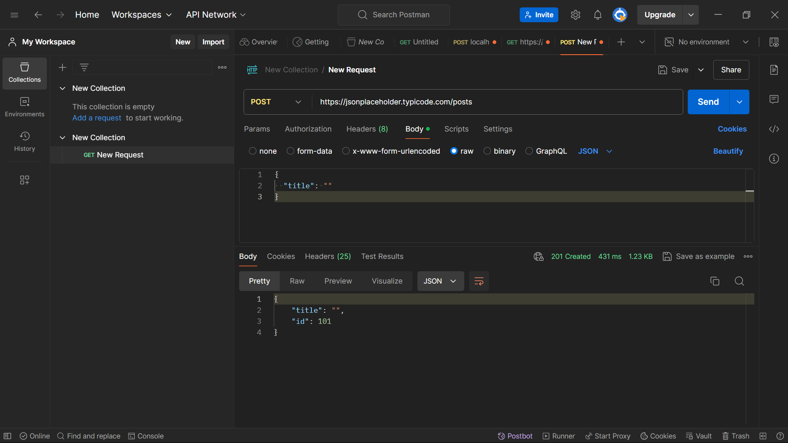

# API Testing and Validation using Postman

## Description
This project demonstrates basic API testing using Postman on public APIs (JSONPlaceholder). It includes testing of GET and POST requests, validation of responses, and negative testing to check how the API handles invalid input.

## Tools Used
- Postman
- JSONPlaceholder API

## Test Scenarios Covered
- Fetching data using GET request
- Creating data using POST request
- Testing API behavior with invalid input

## Test Cases

| Test Case ID | Description               | Expected Result        | Actual Result | Status |
|--------------|---------------------------|------------------------|--------------|--------|
| TC01         | GET users                 | Status 200             | 200 OK       | Pass   |
| TC02         | Create post               | Status 201             | 201 Created  | Pass   |
| TC03         | Invalid input (empty)     | Error expected         | Accepted     | Fail   |

## Bug Observation
The API accepts invalid input (empty fields) and still returns a success response (201 Created). This indicates missing input validation.

## Testing Performed
- Functional Testing
- API Testing
- Negative Testing

## Screenshots

### GET Request

### POST Request

### Negative Testing

